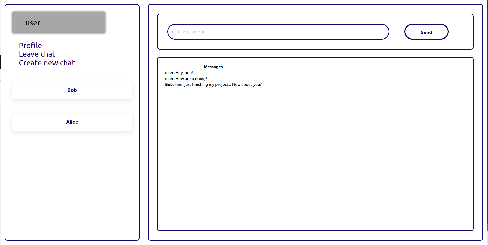

# messenger

This is a real-time messaging application built using **Spring Boot** (backend) and **React.js** (frontend). It supports **private** and **group chats**, allowing users to exchange **text messages**, **images**, and **files**.




### Features

- 🔒 User authentication: registration, login, logout, password reset, account deletion
- 📧 Email verification and email-based notifications (e.g., password reset emails)
- 💬 Real-time messaging (WebSocket-based)
- 📎 File and image sharing (max. 4MB per file)
- 👥 Creation of private and group chats
- 🔐 **End-to-end encryption** of messages and files

### License
This project is developed under an MIT license.

### Requirements

To run the project is needed:
- **Docker** and **Docker Compose** (to start the required services)
- **Node.js** and **npm** (to run the frontend application)

### Installation
In order for the server to start, both the **database** and the **SMTP mail client** need to be running.  
These services are already configured in the [`docker-compose.yml`](docker-compose.yml) file and can be started together using Docker Compose.

The application connects by default to a MySQL database at `localhost:3306`, using:
- Database name: `springdb`
- Username: `spring`
- Password: `password`

For email functionality (e.g., account verification, password reset), an SMTP client is required.  
The project uses [**MailHog**](https://github.com/mailhog/MailHog) as a lightweight SMTP server for development and testing.  
MailHog is also started via Docker Compose and does not require additional configuration.

To start all required services, simply run:

```bash
docker-compose up -d
```

Next, run the **backend**:

```bash
./mvnw spring-boot:run
```

Finally, run **frontend**:
```bash
cd frontend
npm install
BROWSER=none npm start
```

### How to use
Once everything is running, open your browser and navigate to [localhost:8081](http://localhost:8081) to start using the application.
